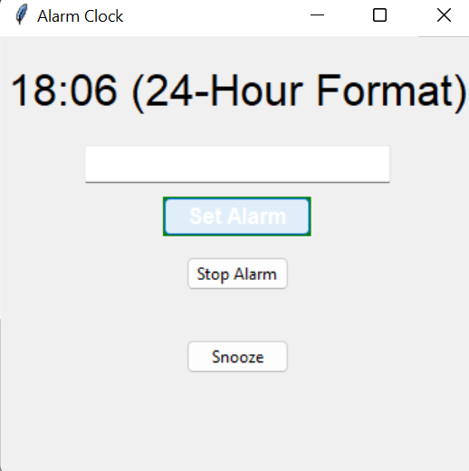

# Alarm Clock App

The Alarm Clock App is a simple GUI application built in Python using the Tkinter library. It allows users to set an alarm time, and when the alarm time is reached, it plays a sound to alert the user.

## Features

- Set an alarm time in 24-hour format (HH:MM).
- Play a sound when the alarm time is reached.
- Stop the alarm sound manually using the "Stop Alarm" button.
- Snooze functionality to temporarily silence the alarm for 5 minutes.

## Requirements

- Python 3.x
- Tkinter library (usually included in Python installations)

## Installation

1. Clone the repository to your local machine or download the ZIP archive.

2. Navigate to the project directory.

3. Install the required dependencies.

## Usage

1. Run the `alarm_clock.py` script.

2. The Alarm Clock GUI will open. Enter the alarm time in the format "HH:MM" in the input field.

3. Click the "Set Alarm" button to set the alarm. The status label will indicate that the alarm is set.

4. The clock will check the alarm time every second. When the alarm time is reached, the sound will play, and the status label will change to "Alarm stopped."

5. To stop the alarm manually, click the "Stop Alarm" button.

6. To snooze the alarm, click the "Snooze" button. The alarm will be silenced for 5 minutes.

## Customize Alarm Sound

You can customize the alarm sound by replacing the `alarm_sound.wav` file in the project directory with your desired sound file. Make sure the new sound file is in WAV format.

## License

This project is licensed under the [MIT License](LICENSE).

